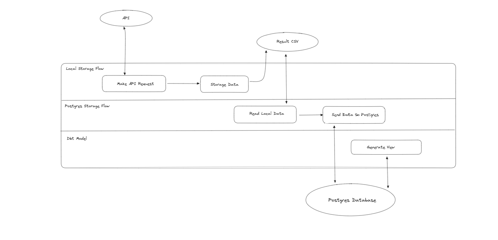

# Desafio de Data Engineer - EMD

Repositório de instrução para o desafio técnico para vaga de Pessoa Engenheira de Dados no Escritório de Dados do Rio de Janeiro

## Descrição do desafio

Neste desafio você deverá capturar, estruturar, armazenar e transformar dados de uma API instantânea. A API consiste nos dados de GPS do BRT que são gerados na hora da consulta com o último sinal transmitido por cada veículo.

Para o desafio, será necessário construir uma pipeline que captura os dados minuto a minuto e gera um arquivo no formato CSV. O arquivo gerado deverá conter no mínimo 10 minutos de dados capturados (estruture os dados da maneira que achar mais conveniente), então carregue os dados para uma tabela no Postgres. Por fim, crie uma tabela derivada usando o DBT. A tabela derivada deverá conter o ID do onibus, posição e sua a velocidade.

A pipeline deverá ser construída subindo uma instância local do Prefect (em Python). Utilize a versão *0.15.9* do Prefect.

## O que iremos avaliar

- Completude: A solução proposta atende a todos os requisitos do desafio?
- Simplicidade: A solução proposta é simples e direta? É fácil de entender e trabalhar?
- Organização: A solução proposta é organizada e bem documentada? É fácil de navegar e encontrar o que se procura?
- Criatividade: A solução proposta é criativa? Apresenta uma abordagem inovadora para o problema proposto?
- Boas práticas: A solução proposta segue boas práticas de Python, Git, Docker, etc.?

## Atenção

- A solução desse desafio deve ser publicada em um fork deste repositório no GitHub.
- O link do repositório deve ser enviado até às 23:59, horário de Brasília, do dia 26 de julho de 2023 (quarta-feira) para o e-mail utilizado para contato com o assunto "Desafio Data Engineer - EMD".
- Você deve ser capaz de apresentar sua solução, explicando como a idealizou, caso seja aprovado(a) para a próxima etapa.

## Links de referência / utilidades

- Documentação [Prefect](https://docs-v1.prefect.io/)
- Documentação [DBT](https://docs.getdbt.com/docs/introduction)
- Instalar e configurar o
   [Prefect Server](https://docs.prefect.io/orchestration/getting-started/install.html)
   locamente com um [Docker Agent](https://docs.prefect.io/orchestration/agents/docker.html)
- Construir a pipeline de captura da [API do
   BRT](https://dados.mobilidade.rio/gps/brt)
- Repositório pipelines do [Escritorio de Dados](https://github.com/prefeitura-rio/pipelines)
- Repositório de modelos DBT do [Escritorio de Dados](https://github.com/prefeitura-rio/queries-datario)

## Dúvidas?

Fale conosco pelo e-mail que foi utilizado para o envio desse desafio.

# Solução

Para resolução deste desafio, foram desenvolvidos 3 processos que ocorrem de forma paralela, a partir do diagrama abaixo pode-se observar o fluxo dos dados.

## Processos

### Local Storage Flow

Processo responsavel pelo armazenamento local dos dados, sua execução consistem em realizar buscar os dados a partir de uma requisição a API e armazena-los de forma costante em um arquivo .csv. O processo possui a frequencia de execução de 1min.

### Postgres Storage Flow

Processo responsavel pelo armazenamento dos dados no banco de dados local Postgres. Sua execução consiste em extrair os dados locais (armazenados no .csv), realizar o tratamento e a inserção dos mesmos em uma tabela (brt_raw) no banco local. O processo possui a frequencia de execução de 13min.

### DBT Model

Processo responsavel pela criação da view contendo a localização e velocidade mais recente de cada objeto armazenado no banco. O modelo consiste na execução de uma query onde-se realiza a consulta e o armazenamento dos dados na view.

## Dependências do Codigo

O código foi desenvolvido considerando as seguintes especificações do sistema.

- Ubuntu 22.04
- Python 3.10.6
- Pip 22.0.2
- Docker 20.10.22

**Atenção:** É fortemente recomendada a utilização de uma virtualenv para a execução deste código, é possivel realizar esse processo a partir de:

`python3 -m venv .venv`

## Execução do Codigo

**Atenção:** Todos as etapas abaixo devem ser executadas a partir do diretório raiz (emd-desafio-data-eng):

Para a instalação das bibliotecas necessarias, pode-se utilizar: 

`pip install -r requirements.txt`

A execução do codigo é feita em duas etapas e executada atraves de um arquivo Makefile: 

### Prefect Flows

Para a execução dos processos de armazenamento, digite o comando:

`make start`

Os processos serão inciados conforme a frequencia definida. Caso queira parar o processo, execute:

`make stop`

#### **Observações**

- A execução do codigo foi desenvolvida de maneira que os dois processos são executados através do mesmo agent, porém também é possivel realizar a execução dos mesmos de forma paralela em agents diferentes. Para isso, é preciso realizar a criação de outro agent e realizar (através do label) a distribuição das execuções.

- O comandos de execução foram definidos a partir de outros subcomandos do Makefile, caso exista o interesse de executar os comandos separadamente, é recomendado que leia o código Makefile. 

### DBT Model

A execução deste processo ocorre através do comando.

`run_dbt`

Seu resultado esta alocado na View: `generate_view` localizada no banco postgres local
